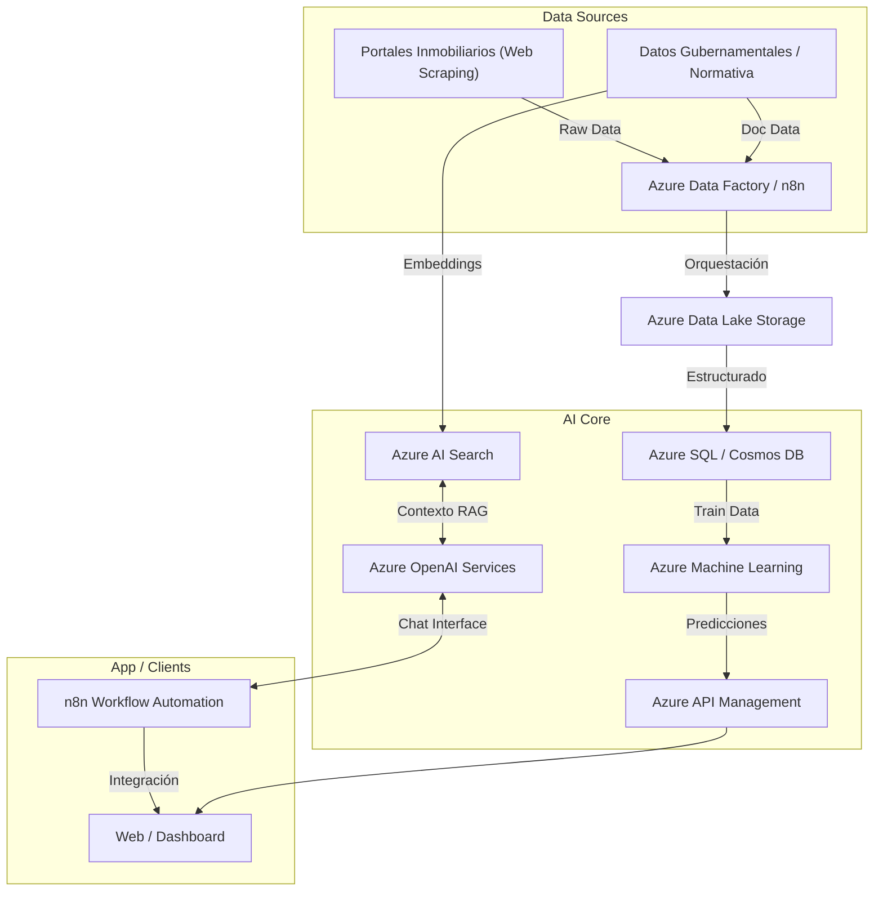

# PropAI BI - Core de Inteligencia de Negocios Inmobiliarios

**Motor de IA Generativa y Predictiva para el Análisis del Mercado Civil**

## Descripción del Proyecto

Este repositorio contiene la arquitectura, documentación y código base del core de inteligencia de PropAI. Nuestra solución utiliza Inteligencia Artificial Generativa y Predictiva para democratizar el acceso a análisis de mercado de alta precisión, optimizando la toma de decisiones en inversiones inmobiliarias y proyectos civiles en Perú.

## Roadmap Técnico (Release 1.0)

El objetivo actual es el desarrollo del MVP técnico centrado en dos pilares:

### 1. Motor de IA Predictiva (Plusvalía)

* **Objetivo:** Proyectar la plusvalía de terrenos urbanos basándose en datos históricos, macroeconómicos y de entorno.
* **Stack:** Python, Azure Machine Learning, n8n (para orquestación de datos).

### 2. Consultor GenAI (Asesor Civil)

* **Objetivo:** Agente experto alimentado con normativa civil peruana, costos de construcción y datos de mercado para asesorar sobre la factibilidad de proyectos.
* **Stack:** Azure OpenAI (GPT-4), Frameworks de RAG, n8n (para interfaz de chat y flows).

## Arquitectura del Sistema (Alto Nivel)

> **Nota:** Si GitHub no renderiza el diagrama de Mermaid automáticamente, puedes subir una imagen de la arquitectura como alternativa.

## Arquitectura — Detalle Técnico de Componentes

La siguiente descripción detalla cada capa del sistema, reflejando los principios de escalabilidad, robustez y seguridad empresarial que guían el diseño de PropAI BI.

### 1. Ingesta y Orquestación de Datos

La capa de ingesta es el punto de entrada de toda la inteligencia del sistema. Se utilizan dos herramientas complementarias:

* **n8n (Workflow Automation):** Orquesta flujos de bajo código para la extracción de datos de portales inmobiliarios mediante web scraping, la integración con APIs externas (INEI, Cofopri, Sunarp) y la entrega de notificaciones o disparadores de pipeline. Su flexibilidad permite ciclos de iteración rápidos y adaptación a cambios en las fuentes de datos.
* **Azure Data Factory (ADF):** Proporciona una orquestación empresarial para pipelines de datos complejos, con capacidades de monitoreo, retries, paralelismo y linaje de datos. ADF gestiona la ingesta en batch de grandes volúmenes hacia Azure Data Lake Storage Gen2 (ADLS), asegurando confiabilidad y trazabilidad.
* **Azure Data Lake Storage Gen2:** Almacena los datos en sus capas *raw*, *curated* y *gold* bajo un modelo Medallion Architecture, garantizando reproducibilidad y auditoría de los datos que alimentan los modelos de IA.

### 2. Motor de IA Predictiva (Azure Machine Learning)

El motor predictivo proyecta la plusvalía futura de terrenos urbanos en Lima Metropolitana integrando variables históricas, macroeconómicas y de entorno urbano.

* **Azure Machine Learning (AML):** Plataforma MLOps que gestiona el ciclo de vida completo del modelo: experimentación, entrenamiento distribuido, registro de versiones, despliegue como endpoint REST y monitoreo de drift en producción.
* **Python & Scikit-learn / XGBoost / LightGBM:** Stack de modelado para la fase de experimentación y entrenamiento del modelo de regresión de plusvalía, con pipelines de feature engineering reproducibles.
* **MLflow (integrado en AML):** Registro y comparación de experimentos, facilitando la selección del mejor modelo candidato para producción.
* **Flujo:** `ADLS (Gold Layer)` → `AML Dataset` → `Training Pipeline` → `Model Registry` → `Online Endpoint (REST API)` → `Azure API Management`.

### 3. Consultor de IA Generativa con RAG (Azure OpenAI + Azure AI Search)

El Consultor Civil es un agente experto basado en Retrieval-Augmented Generation (RAG) que responde consultas sobre factibilidad de proyectos civiles, normativa urbanística y estimaciones de costo de construcción en Perú.

* **Azure OpenAI Service (GPT-4):** Modelo de lenguaje de gran escala que actúa como el "cerebro" del consultor, generando respuestas contextualizadas, estructuradas y fundamentadas a partir del contexto recuperado.
* **Azure AI Search:** Índice vectorial y de texto completo que almacena los embeddings de los documentos normativos (RNE, parámetros urbanísticos distritales, tablas de costos de Capeco). Ejecuta la búsqueda semántica para recuperar los fragmentos más relevantes ante cada consulta del usuario.
* **LangChain / Semantic Kernel:** Framework de orquestación que gestiona la cadena RAG: reformulación de la consulta, recuperación de contexto desde Azure AI Search, construcción del prompt y llamada al modelo GPT-4. Permite encadenamiento de herramientas (tools/agents) para consultas multi-paso.
* **n8n (Chat Interface):** Expone el agente como un flujo de chat accesible desde el dashboard o vía webhook, sin necesidad de infraestructura de frontend dedicada en fases tempranas del MVP.
* **Flujo:** `Consulta del Usuario` → `n8n` → `LangChain Agent` → `Azure AI Search (Retrieval)` → `Azure OpenAI (Generation)` → `Respuesta Fundamentada`.

### 4. Entrega y Consumo (Azure API Management + Dashboard)

* **Azure API Management (APIM):** Gateway centralizado que expone los endpoints del Motor Predictivo (AML) y del Consultor GenAI (OpenAI) bajo políticas unificadas de autenticación (OAuth2 / API Keys), rate limiting, logging y versionado de APIs. Es el punto de integración hacia cualquier cliente externo.
* **Web / Dashboard:** Aplicación frontend (React / Next.js o Power BI Embedded) que consume las APIs a través de APIM, visualizando proyecciones de plusvalía y permitiendo la interacción con el consultor civil.

### 5. Justificación de Escalabilidad, Robustez y Seguridad

| Dimensión | Decisión de Arquitectura | Justificación |
|---|---|---|
| **Escalabilidad** | Arquitectura serverless y PaaS (AML Endpoints, APIM, Azure Functions) | Escala automáticamente según demanda sin gestión de infraestructura. |
| **Escalabilidad de Datos** | ADLS Gen2 + Medallion Architecture | Soporta crecimiento de datos desde GB hasta PB sin rediseño. |
| **Robustez** | ADF con retry policies + MLflow Model Registry | Garantiza reproducibilidad de pipelines y rollback a versiones estables del modelo. |
| **Seguridad** | Azure AD, Managed Identities, APIM + Key Vault | Sin credenciales en código; acceso basado en identidades gestionadas por Azure. |
| **Observabilidad** | Azure Monitor + Application Insights | Trazabilidad end-to-end de requests, alertas de latencia y monitoreo de drift del modelo. |

## Estado Actual de Validación Técnica

* [x] Diseño de Arquitectura Lógica en la Nube (Azure).
* [x] Identificación y Estructuración de Fuentes de Datos (Lima Metropolitana).
* [x] Prototipado de flujos de orquestación en n8n.
* [ ] Entrenamiento del modelo predictivo base (en desarrollo).
* [ ] Configuración del Agente GenAI con RAG (en desarrollo).
* [ ] Despliegue de API Gateway.

## Contacto del Fundador

**Ninkovski**: Senior Software Engineer | Ingeniero Mecatrónico (UNI) | Maestría Gestión TI (PUCP) | Estudiante Ing. Civil.
