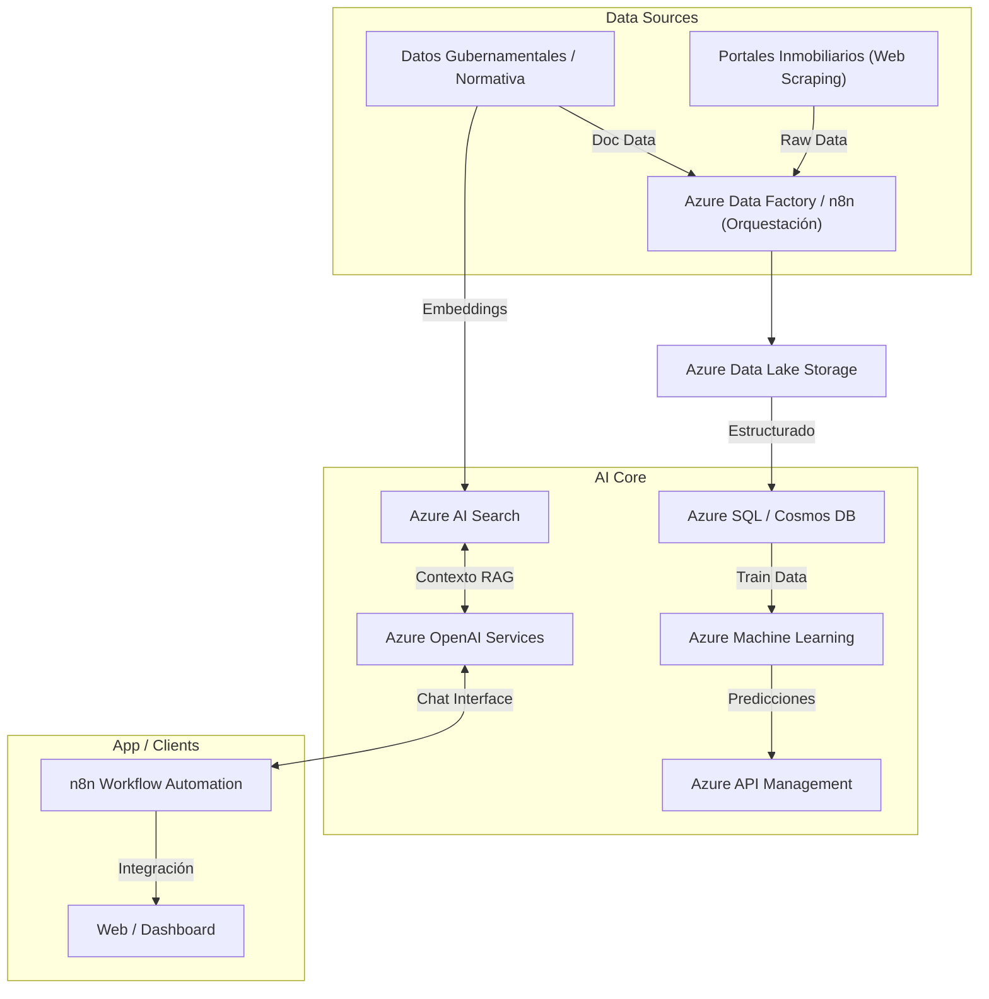

# PropAI BI - Core de Inteligencia de Negocios Inmobiliarios

**Motor de IA Generativa y Predictiva para el Análisis del Mercado Civil**

## Descripción del Proyecto

Este repositorio contiene la arquitectura, documentación y código base del core de inteligencia de PropAI. Nuestra solución utiliza Inteligencia Artificial Generativa y Predictiva para democratizar el acceso a análisis de mercado de alta precisión, optimizando la toma de decisiones en inversiones inmobiliarias y proyectos civiles en Perú.

## Roadmap Técnico (Release 1.0)

El objetivo actual es el desarrollo del MVP técnico centrado en dos pilares:

### 1. Motor de IA Predictiva (Plusvalía)

* **Objetivo:** Proyectar la plusvalía de terrenos urbanos basándose en datos históricos, macroeconómicos y de entorno.
* **Stack:** Python, Azure Machine Learning, n8n (para orquestación de datos).

### 2. Consultor GenAI (Asesor Civil)

* **Objetivo:** Agente experto alimentado con normativa civil peruana, costos de construcción y datos de mercado para asesorar sobre la factibilidad de proyectos.
* **Stack:** Azure OpenAI (GPT-4), Frameworks de RAG (LangChain / Semantic Kernel), n8n (para interfaz de chat y flows).

## Arquitectura del Sistema (Alto Nivel)

## Arquitectura: Detalle Técnico de Componentes

### Stack Tecnológico

#### 1. Ingesta y Orquestación de Datos

La capa de ingesta es el fundamento del sistema. Combina dos herramientas complementarias:

- **n8n (Workflow Automation):** Orquesta flujos de extracción de datos desde portales inmobiliarios mediante web scraping (Puppeteer/Playwright), normaliza la estructura de los datos crudos y gestiona la ingesta continua. Su enfoque low-code agiliza la creación y mantenimiento de conectores.
- **Azure Data Factory (ADF):** Se encarga de la ingesta de grandes volúmenes de datos estructurados y semi-estructurados desde fuentes oficiales (registros gubernamentales, SUNARP, municipalidades), garantizando la trazabilidad y linaje de los datos en pipelines ETL/ELT robustos.
- **Azure Data Lake Storage (ADLS Gen2):** Actúa como repositorio central en arquitectura Data Lakehouse, almacenando datos en las capas Bronze (raw), Silver (curado) y Gold (listo para consumo analítico).

#### 2. Motor de IA Predictiva (Plusvalía Inmobiliaria)

- **Azure Machine Learning (AML):** Plataforma central para el ciclo de vida de los modelos de ML. Gestiona el entrenamiento, versionado, evaluación y despliegue de modelos de regresión espaciotemporal para proyección de plusvalía.
- **Python (scikit-learn, XGBoost, Prophet):** Stack principal de data science para feature engineering sobre variables geoespaciales, macroeconómicas (tipo de cambio, inflación, PBI) e indicadores de entorno urbano.
- **MLflow (integrado en AML):** Tracking de experimentos, registro de modelos y gestión del ciclo de vida (MLOps).
- **Azure Kubernetes Service (AKS):** Despliegue de los modelos entrenados como endpoints REST escalables para consumo en tiempo real desde el API Gateway.

#### 3. Consultor de IA Generativa con enfoque RAG

- **Azure OpenAI Service (GPT-4o):** Modelo de lenguaje base que actúa como motor de razonamiento del Consultor Civil. Procesa contexto recuperado y genera respuestas técnicas fundamentadas.
- **Azure AI Search:** Indexa y vectoriza el corpus de normativa civil peruana (RNE, parámetros urbanísticos, normas técnicas) y datos de mercado. Implementa búsqueda híbrida (semántica + keyword) para el paso de recuperación del pipeline RAG.
- **LangChain / Semantic Kernel:** Framework de orquestación para el pipeline RAG. Gestiona la cadena: recepción de consulta → recuperación de contexto → augmentación del prompt → generación → respuesta.
- **n8n (Chat Interface):** Expone el agente como flujo conversacional, integrándose con canales de comunicación (web widget, WhatsApp Business API) sin necesidad de desarrollo frontend adicional en etapas tempranas.

#### 4. Justificación Arquitectural: Escalabilidad, Robustez y Seguridad

- **Escalabilidad:** La arquitectura serverless y basada en servicios gestionados de Azure (AML, AKS, ADLS) permite escalar cada capa de forma independiente según la demanda, sin gestionar infraestructura subyacente. El uso de ADLS como Data Lakehouse evita la proliferación de silos de datos.
- **Robustez:** Los pipelines de ADF y n8n incluyen mecanismos de reintento, alertas y monitoreo. El modelo de datos en capas (Bronze/Silver/Gold) garantiza la integridad y calidad del dato antes de que llegue a los modelos de IA. MLflow asegura la reproducibilidad y trazabilidad de los experimentos.
- **Seguridad:** Toda la arquitectura reside dentro de Azure, aprovechando Azure Active Directory para autenticación, Azure Key Vault para gestión de secretos y credenciales de API, y Azure Private Endpoints para comunicación intra-servicio sin exposición a internet. El cumplimiento de normativas de privacidad (datos de mercado no incluyen PII crítico) está considerado desde el diseño.

## Estado Actual de Validación Técnica

- [x] Diseño de Arquitectura Lógica en la Nube (Azure).
- [x] Identificación y Estructuración de Fuentes de Datos (Lima Metropolitana).
- [x] Prototipado de flujos de orquestación en n8n.
- [ ] Entrenamiento del modelo predictivo base (en desarrollo).
- [ ] Configuración del Agente GenAI con RAG (en desarrollo).
- [ ] Despliegue de API Gateway.

## Contacto del Fundador

**Ninkovski** — Senior Software Engineer (8 años de experiencia en Azure y automatización) | Ingeniero Mecatrónico (UNI) | Maestría en Gestión de TI (PUCP) | Estudiante de Ingeniería Civil.
